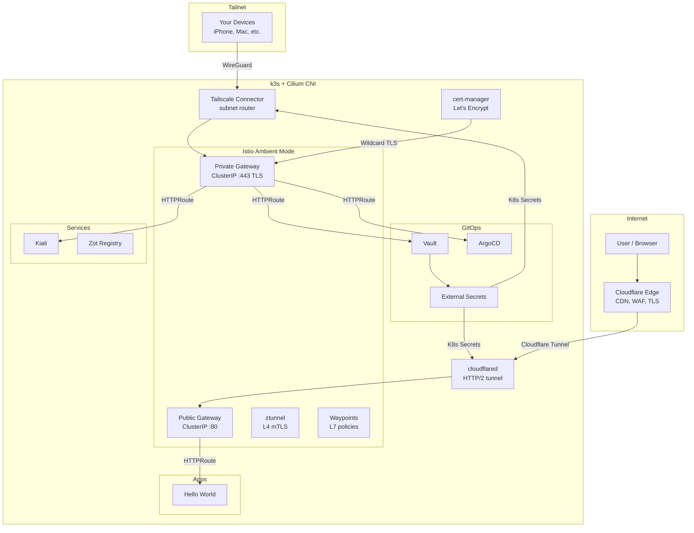
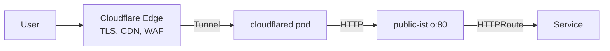
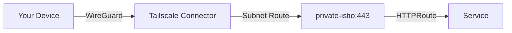
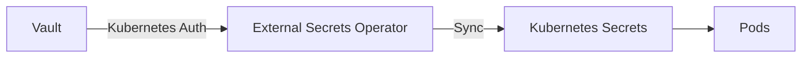

# Architecture

## Stack Overview



## Traffic Flows

### Public: Internet → Service



- Cloudflare handles TLS termination, CDN, WAF, DDoS protection
- cloudflared connects outbound via HTTP/2 (QUIC broken with Cilium VXLAN MTU)
- Tunnel config managed in Cloudflare dashboard (remotely managed)
- HTTPRoutes on the public gateway match hostnames and route to services
- Example: `hello.mmonteiro.dev` → hello-world app

### Private: Tailnet → Service



- Tailscale Connector advertises service CIDR to your tailnet
- Wildcard DNS `*.mmonteiro.dev → 10.43.241.105` in Cloudflare (DNS only, no proxy)
- Private gateway terminates TLS with Let's Encrypt wildcard cert
- HTTPRoutes on the private gateway match hostnames and route to services
- Example: `kiali.mmonteiro.dev`, `vault.mmonteiro.dev`, `argocd.mmonteiro.dev`

## Domain: mmonteiro.dev

All services use the same domain. Resolution differs based on where you are:

| Service | Type | URL | Access |
|---------|------|-----|--------|
| Hello World | Public | hello.mmonteiro.dev | Internet (Cloudflare) |
| Kiali | Private | kiali.mmonteiro.dev | Tailnet only |
| Vault | Private | vault.mmonteiro.dev | Tailnet only |
| ArgoCD | Private | argocd.mmonteiro.dev | Tailnet only |

**Public services**: CNAME record in Cloudflare pointing to the tunnel (proxy ON).
**Private services**: Wildcard A record `*.mmonteiro.dev → 10.43.241.105` (DNS only, proxy OFF). Only reachable from tailnet via the Connector.

## How to Expose a New Public Service

1. Create a Deployment + Service in `gitops/03-apps/`
2. Add an HTTPRoute on the public gateway:
   ```yaml
   spec:
     parentRefs:
       - name: public
         namespace: istio-system
         sectionName: http
     hostnames:
       - "myapp.mmonteiro.dev"
     backendRefs:
       - name: myapp
         port: 80
   ```
3. In Cloudflare dashboard → tunnel → add public hostname:
   - Subdomain: `myapp`, Domain: `mmonteiro.dev`
   - Service: `http://public-istio.istio-system.svc.cluster.local:80`

## How to Expose a New Private Service

1. Create a Deployment + Service
2. Add an HTTPRoute on the private gateway:
   ```yaml
   spec:
     parentRefs:
       - name: private
         namespace: istio-system
         sectionName: https
     hostnames:
       - "myservice.mmonteiro.dev"
     backendRefs:
       - name: myservice
         port: 8080
   ```
3. No DNS config needed — the wildcard `*.mmonteiro.dev` already resolves to the private gateway

## Secrets Management



- Vault path pattern: `secret/<namespace>/<secret-name>`
- ExternalSecret resources pull from Vault into native K8s Secrets
- Vault authenticates ESO via Kubernetes service account (no tokens to manage)
- Vault UI at `vault.mmonteiro.dev` (private)

### Secrets stored in Vault

| Path | Description |
|------|-------------|
| `secret/cloudflared/tunnel-token` | Cloudflare tunnel token |
| `secret/cloudflare/api-token` | Cloudflare API token (cert-manager DNS-01) |
| `secret/tailscale/operator` | OAuth client-id + client-secret |

## TLS

- **Public**: Cloudflare handles TLS → tunnel → plain HTTP to public gateway
- **Private**: cert-manager issues Let's Encrypt wildcard cert (`*.mmonteiro.dev`) via DNS-01 challenge with Cloudflare API → private gateway terminates TLS
- Certificate auto-renews via cert-manager

## GitOps Structure

```
gitops/
├── 00-bootstrap/     # ArgoCD raw install, repo, projects, ApplicationSets
├── 01-core/          # Infrastructure: Istio, Vault, ESO, cert-manager, Tailscale
├── 02-services/      # Shared services: Kiali, cloudflared, Zot registry
└── 03-apps/          # User applications: hello-world, etc.
```

ArgoCD ApplicationSets auto-discover directories and create Applications. Each layer has two ApplicationSets:
- `*-applications`: syncs `*-Application.yaml` files (Helm charts)
- `*-manifests`: syncs everything else (raw YAML)
